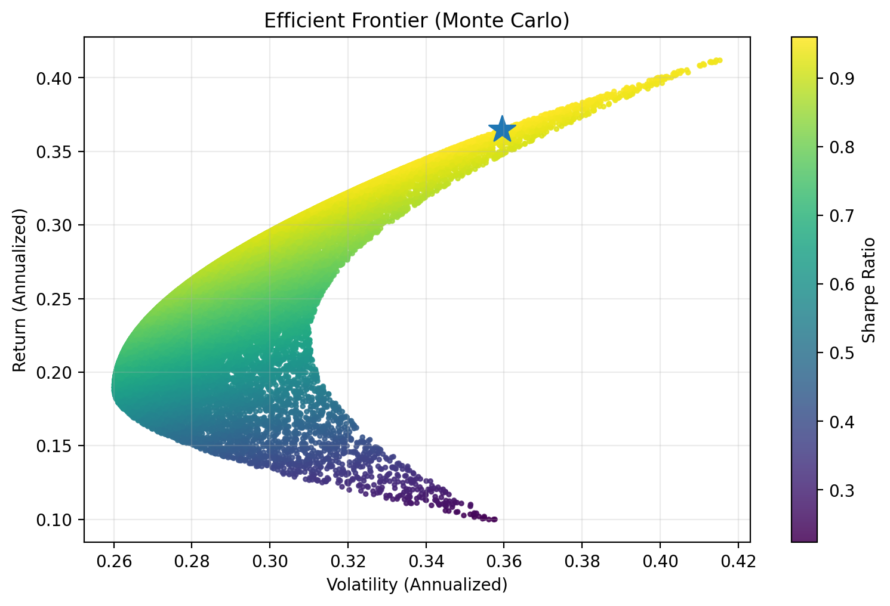
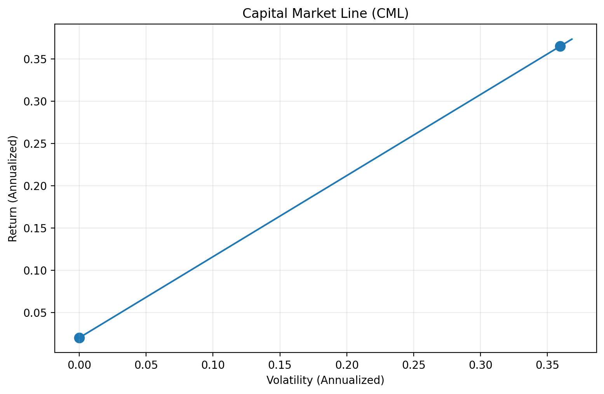

# 📊 CAPM Portfolio Optimizer

**Optimal Portfolio Allocation using CAPM & Modern Portfolio Theory**

> CAPM 기반 포트폴리오 최적화 프로젝트  
> Sharpe Ratio를 최대화하는 **최적 자산 배분(Optimal Portfolio)** 을 찾습니다.

---

---

## 📖 Overview | 프로젝트 개요

In financial markets, investors constantly face the trade-off between **risk and return**.  
Modern Portfolio Theory (MPT) provides a mathematical framework to analyze this relationship and construct efficient portfolios.

This project aims to implement a **portfolio optimization framework** based on CAPM/MPT principles.  
By estimating **expected returns** and the **covariance structure** of asset returns, we search for the portfolio allocation that maximizes the **Sharpe ratio**, representing the best risk-adjusted return.

Through this project, I explore how **mathematical modeling, statistical estimation, and programming** can be combined to better understand portfolio construction and systematic investment strategies.

금융 시장에서는 항상 **위험과 수익 사이의 균형(trade-off)** 문제가 존재합니다.  
Modern Portfolio Theory(MPT)는 이러한 관계를 **수학적으로 분석하고 효율적인 포트폴리오를 구성하는 방법**을 제공합니다.

본 프로젝트에서는 CAPM/MPT 기반 포트폴리오 이론을 구현하여

- 자산 기대수익률 추정
- 공분산 구조 분석
- Sharpe Ratio 최대화

를 통해 **위험 대비 수익이 가장 효율적인 포트폴리오를 탐색**합니다.

이를 통해 **수학적 모델링, 통계적 분석, 그리고 프로그래밍이 금융 문제 해결에 어떻게 활용될 수 있는지** 탐구합니다.

---

# 🎯 Optimization Problem | 최적화 문제

We find portfolio weights that maximize the Sharpe ratio.

where

---

# 📂 Dataset

| Item | Description |
|-----|-------------|
| Source | Yahoo Finance |
| Data | Historical market prices |
| Frequency | Daily |
| Processing | Converted into return series |

가격 데이터를 수집한 뒤 **수익률 데이터로 변환하여 분석**합니다.

---

# ⚙️ Methodology

## 1️⃣ Data Preprocessing

- Download price data
- Handle missing values
- Compute asset returns

수익률 계산

---

## 2️⃣ Parameter Estimation

- Expected return vector μ
- Covariance matrix Σ

자산 수익률의 평균과 공분산을 계산합니다.

---

## 3️⃣ Monte Carlo Simulation

Random portfolios are generated and evaluated.

Example:

N = 10000

각 포트폴리오에 대해

- 기대수익률
- 변동성
- Sharpe Ratio

를 계산합니다.

---

## 4️⃣ Optimal Portfolio Selection

The portfolio with the **maximum Sharpe ratio** is selected.

Sharpe Ratio가 가장 높은 포트폴리오를 **최적 포트폴리오**로 선택합니다.

---

# 📈 Results

## Efficient Frontier

위험과 기대수익률 사이의 관계를 나타냅니다.

---

## Capital Market Line

위험 대비 수익이 가장 효율적인 포트폴리오를 보여줍니다.

---

# 📊 Example Optimal Portfolio

| Asset | Weight |
|------|------|
| Asset A | 0.xx |
| Asset B | 0.xx |
| Asset C | 0.xx |

Example statistics

- Max Sharpe Ratio: x.xx  
- Expected Return: x.xx  
- Volatility: x.xx  

---

# 🔬 Interpretation | 해석

Under CAPM/MPT assumptions, there exists a portfolio that maximizes **risk-adjusted return**.

이는 Efficient Frontier 상의 **Tangency Portfolio**로 해석할 수 있습니다.

---

# ⚠️ Limitations

- CAPM strong assumptions
- Historical estimation bias
- Transaction costs not considered

---

# 🚀 Future Work

Possible extensions:

- Black–Litterman model
- Robust covariance estimation
- GARCH volatility modeling
- Transaction cost modeling
- Out-of-sample backtesting

---

# 💻 How to Run

python -m venv .venv  
source .venv/bin/activate  
pip install -r requirements.txt  
jupyter notebook  

---

# 🧰 Tech Stack

Python  
NumPy  
Pandas  
Matplotlib  
yfinance  

---

## 👨‍💻 Author

**twoye0**

Financial Mathematics Student  
Interested in **Quantitative Finance · Mathematical Modeling · Systematic Trading**

GitHub: https://github.com/twoye0
